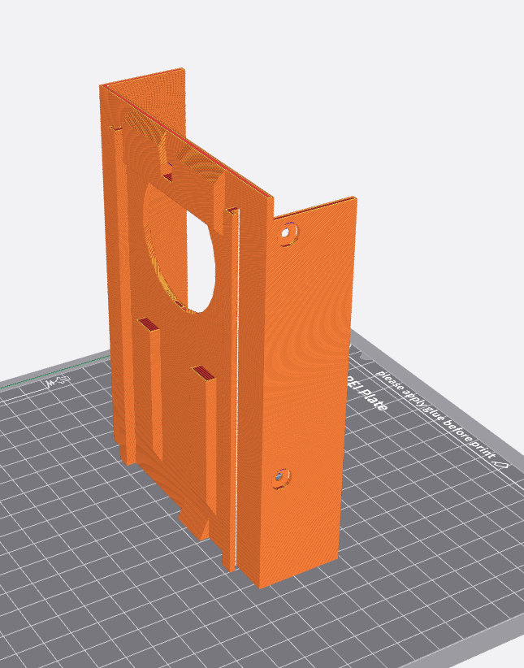

# Macintosh Color Classic Fan Housing

## What

This printable is a drop-in replacement for the Macintosh Color Classic Floppydrive housing.
Also known as part 815-0445. The housing is used across different models, like the 840AV and probably a lot more. 

## How to
- 15% infill
- No support needed
- Print horizontally, like this:
- 

## Disclaimer
I will not be held liable for damages, injury or even death resulting from this part. Build and use this part only at your own risk.

